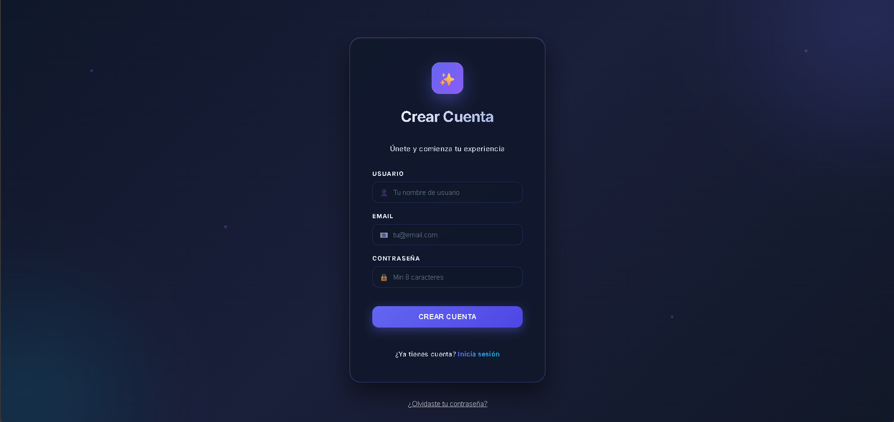
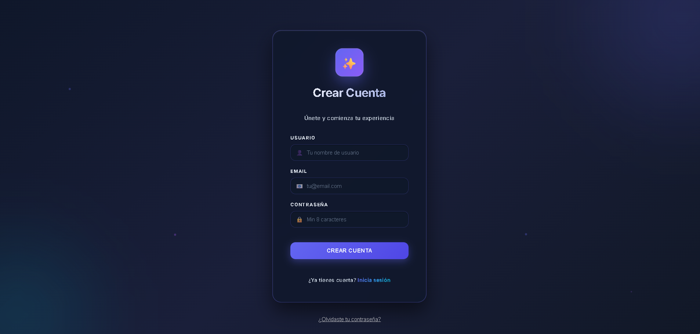
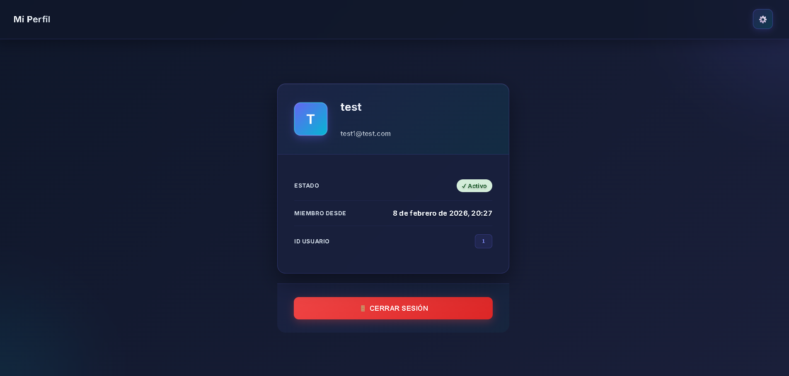
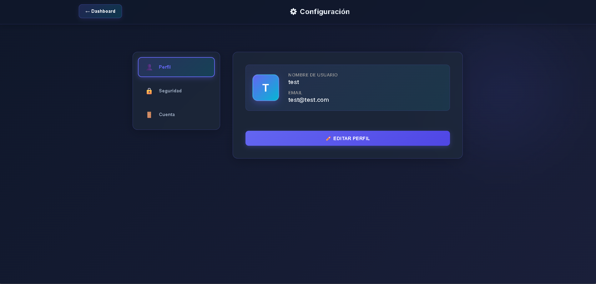

# 🔐 Sistema de Autenticación - Aplicación Profesional de Login

<p align="center">
  
  
  
  
  
</p>

---

## 📋 Descripción General

Un **sistema de autenticación de nivel profesional** con un frontend React moderno y responsivo en TypeScript y un backend FastAPI robusto. Incluye gestión completa de usuarios, edición de perfiles, características avanzadas de seguridad de contraseñas y un dashboard en tiempo real. Perfecto para portfolios profesionales e implementación en producción.

### ✨ Características Principales

- **Interfaz Moderna y Elegante** - Diseño glassmorphism con animaciones suaves y gradientes
- **TypeScript 100%** - Codebase frontend completamente tipado y seguro
- **Autenticación Segura** - Tokens JWT con expiración de 30 minutos
- **Protección contra Ataques** - Rate limiting (5 intentos por 5 minutos)
- **Características Avanzadas** - Editar perfil, cambiar contraseña, reset con tokens
- **Diseño Profesional** - Tema oscuro con esquema de colores púrpura y cian
- **Diseño Responsivo** - Compatible con desktop, tablet y dispositivos móviles

## 🎯 Funcionalidades

### Autenticación

- ✅ Registro de usuarios con validación de correo electrónico
- ✅ Login seguro con usuario y contraseña
- ✅ Gestión de sesiones basada en JWT (tokens de 30 minutos)
- ✅ Rate limiting (5 intentos de login por 5 minutos)
- ✅ Logout automático y gestión de sesiones
- ✅ Validación de fortaleza de contraseña

### Gestión de Usuarios

- ✅ Visualización del perfil de usuario con información de cuenta
- ✅ Edición de perfil (usuario, correo electrónico, detalles de cuenta)
- ✅ Cambio de contraseña con validación
- ✅ Recuperación de contraseña con tokens seguros
- ✅ Indicadores de estado de cuenta
- ✅ Seguimiento de fecha de membresía

### Interfaz y Experiencia de Usuario (UI/UX)

- ✅ Tema oscuro con efectos glassmorphism
- ✅ Animaciones suaves y transiciones fluidas
- ✅ Validación de formularios con retroalimentación visual
- ✅ Navegación responsiva con sidebar
- ✅ Interfaz de configuración con pestañas
- ✅ Notificaciones Toast para feedback del usuario

## 🛠 Stack Tecnológico

| Capa                     | Tecnología                   | Versión    |
| ------------------------ | ---------------------------- | ---------- |
| **Frontend**             | React + TypeScript           | 19.2 + 5.3 |
| **Herramienta de Build** | Vite                         | 7.2        |
| **Estado Frontend**      | React Hooks                  | -          |
| **Estilos**              | CSS3 (Variables, Gradientes) | -          |
| **Backend**              | FastAPI                      | 0.104+     |
| **Lenguaje**             | Python                       | 3.9+       |
| **Base de Datos**        | SQLAlchemy + SQLite          | -          |
| **Autenticación**        | PyJWT + bcrypt               | -          |
| **Seguridad**            | python-jose                  | -          |

## 📦 Requisitos Previos

- **Node.js** >= 20.19 o >= 22.12
- **npm** >= 8.x
- **Python** >= 3.9
- **pip**

## ⚡ Inicio Rápido

### Opción 1: Instalación Automática (Recomendado)

#### Windows (PowerShell):

```powershell
./install.ps1
```

#### Unix/Linux/Mac:

```bash
chmod +x install.sh
./install.sh
```

### Opción 2: Instalación Manual

#### Backend

```bash
# Navegar a la carpeta backend
cd backend

# Crear entorno virtual
python -m venv venv

# Activar (Windows)
venv\Scripts\activate
# Activar (Mac/Linux)
source venv/bin/activate

# Instalar dependencias
pip install -r requirements.txt

# Iniciar servidor (se ejecuta en http://localhost:8000)
python -m uvicorn app.main:app --reload --host 0.0.0.0 --port 8000
```

#### Frontend

```bash
# Navegar a la carpeta frontend
cd frontend

# Instalar dependencias
npm install

# Iniciar servidor de desarrollo (se ejecuta en http://localhost:5173)
npm run dev
```

## 🚀 Uso

1. Abre **http://localhost:5173** en tu navegador
2. **Regístrate** con una nueva cuenta o **inicia sesión** con tus credenciales
3. **Explora las funcionalidades:**
   - Visualiza tu perfil en el dashboard
   - Accede a Configuración mediante el icono ⚙️
   - Edita tu perfil, cambio de contraseña o resetéala
   - Cierra sesión de forma segura

## Galería del Proyecto

### Interfaz de Autenticación


_Pantalla de inicio de sesión con validación en tiempo real_

### Registro de Usuario


_Formulario de registro con validación de contraseña avanzada_

### Dashboard y Gestión de Usuarios


_Panel de bienvenida con información del usuario_


_Panel de configuración y preferencias_

## 📁 Estructura del Proyecto

```
Login/
├── backend/
│   ├── app/
│   │   ├── auth.py              # Utilidades de JWT y contraseñas
│   │   ├── database.py          # Configuración de SQLAlchemy
│   │   ├── main.py              # Aplicación FastAPI y endpoints
│   │   ├── models.py            # Modelos ORM de SQLAlchemy
│   │   └── schemas.py           # Esquemas Pydantic de request/response
│   └── requirements.txt
│
├── frontend/
│   ├── src/
│   │   ├── api.js               # Funciones cliente API
│   │   ├── App.css              # Estilos globales
│   │   ├── App.tsx              # Componente principal
│   │   ├── main.tsx             # Punto de entrada de React
│   │   ├── components/
│   │   │   ├── Login.tsx
│   │   │   ├── Register.tsx
│   │   │   ├── Dashboard.tsx
│   │   │   ├── Settings.tsx
│   │   │   ├── EditProfile.tsx
│   │   │   ├── ChangePassword.tsx
│   │   │   └── ResetPassword.tsx
│   │   ├── hooks/
│   │   │   ├── useAuth.ts       # Hook de contexto de autenticación
│   │   │   └── useToast.ts      # Hook de notificaciones Toast
│   │   ├── styles/
│   │   │   ├── Dashboard.css
│   │   │   ├── Settings.css
│   │   │   ├── EditProfile.css
│   │   │   └── ChangePassword.css
│   │   ├── types/
│   │   │   └── index.ts         # Interfaces TypeScript
│   │   └── utils/
│   │       └── validation.ts    # Utilidades de validación de formularios
│   ├── package.json
│   ├── tsconfig.json            # Configuración de TypeScript
│   └── vite.config.js           # Configuración de Vite
│
├── install.ps1                  # Script instalador Windows
├── install.sh                   # Script instalador Unix
└── README.md
```

## 🔌 Endpoints de la API

### Autenticación

| Método | Endpoint    | Descripción                           |
| ------ | ----------- | ------------------------------------- |
| POST   | `/register` | Registrar nuevo usuario               |
| POST   | `/login`    | Login de usuario, devuelve token JWT  |
| POST   | `/logout`   | Logout de usuario, invalida la sesión |

### Gestión de Usuarios

| Método | Endpoint           | Descripción                                   |
| ------ | ------------------ | --------------------------------------------- |
| GET    | `/me`              | Obtener perfil del usuario actual             |
| PUT    | `/me`              | Actualizar perfil de usuario                  |
| POST   | `/change-password` | Cambiar contraseña de usuario                 |
| POST   | `/forgot-password` | Solicitar token de recuperación de contraseña |
| POST   | `/reset-password`  | Resetear contraseña con token                 |

## 🔒 Características de Seguridad

- **Encriptación de Contraseñas**: bcrypt con salt (10 rondas)
- **Autenticación JWT**: Expiración de tokens en 30 minutos
- **Rate Limiting**: 5 intentos de login por 5 minutos
- **Protección CORS**: Configurada para producción
- **Prevención de SQL Injection**: ORM de SQLAlchemy
- **Tokens de Recuperación**: Tokens criptográficamente seguros con expiración
- **Validación de Entrada**: Esquemas Pydantic con validación estricta

## 🎨 Diseño e Interfaz

- **Paleta de Colores**: Azul marino oscuro (#0f172a) con acentos índigo (#6366f1) y cian (#06b6d4)
- **Tipografía**: Familia Inter para un aspecto moderno y limpio
- **Efectos**: Glassmorphism con desenfoque trasero y animaciones suaves
- **Diseño Responsivo**: Mobile-first con puntos de quiebre para todos los dispositivos
- **Accesibilidad**: Contraste de colores compatible con WCAG y navegación por teclado

## 📄 Licencia

Este proyecto está bajo la licencia **MIT** - consulta el archivo LICENSE para más detalles.
